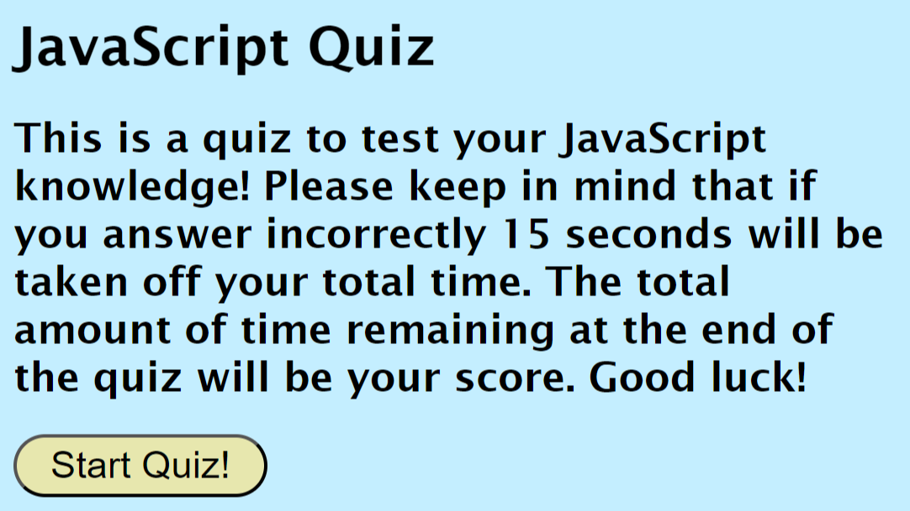

# code-quiz

## Description

I created this code quiz to help students learning JavaScript remember certain concepts. I wanted to include a time/score aspect in this quiz in order to add a competitive element. This project gave me a lot of practice and a better understanding of JavaScript. I really became more comfortable using methods such as sort(), append(), setItem() and getItem(), to name a few. I also became more familiar with using DOM traversal and local storage. Finally, while working on this project, I realized the importance of breaking down complex problems into smaller ones.

## Installation

N/A

## Usage

This quiz is multiple choice and has 5 questions total. To begin the quiz, click "Start Quiz!". The first question will be displayed and the timer will start its countdown from 100. Users can use their mouse to click on the answer they think is correct. If the user answers the question incorrectly, 15 seconds will be taken away from the countdown. If the user answers the question correctly, no time will be taken from the countdown. Once all 5 questions are answered, or if the timer runs out, the user will be able to view their final score and can enter their initials. Once they hit submit, they will be taken to the high scores page. There, they can see their score along with the scores of other users.

Link to deployed app: https://mnettath.github.io/code-quiz/

## Credits

N/A

## License

N/A
